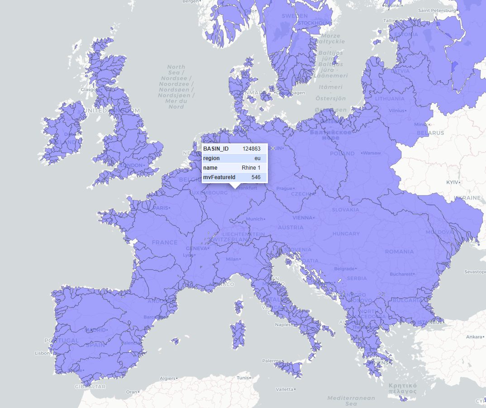
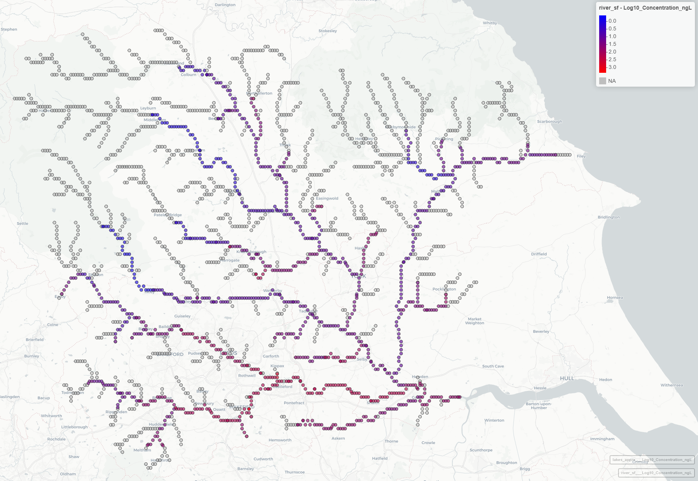

## ePiE
ePiE is a spatially explicit model that estimates concentrations of active pharmaceutical ingredients (APIs) in surface waters across Europe. This repository contains the R package of the ePiE model alongside all the required input parameters, such as the parameterized European river catchment and discharge data. 

## ePiE: Installation

Run the code below to make sure all dependencies are installed (because ePiE is not yet in CRAN, this needs to be done manually).

``` r
if(!require("Rcpp")) install.packages("Rcpp")
if(!require("terra")) install.packages("terra")
if(!require("sf")) install.packages("sf")
if(!require("mapview")) install.packages("mapview")
```

Next, the ePiE package can be directly installed from R using the regular `install.packages()` function, see the code below.

``` r
# Install the R package on Windows
install.packages("https://github.com/SHoeks/ePiE/raw/refs/heads/main/ePiE_1.25.zip", 
                 repos=NULL, 
                 method="libcurl")

# Install the R package on Mac/Linux
install.packages("https://github.com/SHoeks/ePiE/raw/refs/heads/main/ePiE_1.25.tar.gz", 
                 repos=NULL, 
                 method="libcurl")
```

## ePiE: Example run

The code below illustrates a simple example run of the ePiE model for Ibuprofen for two river basins. 
This example is mainly intended to provide an overview of the ePiE R package workflow.

First the ePiE R package needs to be loaded.

```r
# Load package
library(ePiE)
```

Next we can load the incluced example API properties for Ibuprofen and use the included QSARs using `CompleteChemProperties()` to fill the gaps in the API data. 
Please make sure if you intend to run the model for a different API or set of APIs the format follows the example `data.frame`.
Here is a dataset for the 35 APIs included in Oldenkamp et al. 2018: 
[link](https://github.com/SHoeks/ePiE/raw/refs/heads/main/Package/inst/chem_input/chem_Oldenkamp2018_SI.xlsx).

```r
# Open API-specific data
chem = LoadExampleChemProperties()

# View the contents of the chemical properties
str(chem)
# > 'data.frame':	1 obs. of  23 variables:
# > $ API                            : chr "Ibuprofen"
# > $ CAS                            : chr "15687-27-1"
# > $ class                          : chr "acid"
# > $ MW                             : num 206
# > $ KOW_n                          : num 9333
# > $ Pv                             : num 0.0248
# > $ S                              : num 21
# > $ pKa                            : num 4.85
# > $ f_u                            : num 0.2
# > $ f_f                            : logi NA
# > $ metab                          : logi NA
# > $ API_metab                      : logi NA
# > $ k_bio_wwtp_n                   : num 0.000197
# > ...

# Complete missing values in chem data
chem = CompleteChemProperties(chem = chem)
```

Next the WWTP removal fraction can be determined using SimpleTreat 4.0, please note that this is just a test to see what the removal fraction will be. 
ePiE will run SimpleTreat 4.0 inside the `ComputeEnvConcentrations()` later on to compute the WWTP removal fraction per WWTP.

```r
# Test SimpleTreat
removal = SimpleTreat4_0(chem_class=chem$class[1],MW=chem$MW[1],Pv=chem$Pv[1],S=chem$S[1],pKa=chem$pKa[1],
               Kp_ps=chem$Kp_ps[1],Kp_as=chem$Kp_as[1],k_bio_WWTP=chem$k_bio_wwtp[1],
               T_air=285,Wind=4,Inh=1000,E_rate=1,PRIM=-1,SEC=-1)

print(removal)
# > $f_rem
# > [1] 0.8919211
# > $C_sludge
# > [1] 21.40704
```

Now we can load the example consumption data using `LoadExampleConsumption()`, the values represent country-specific yearly consumption (kg/year/country).
Please note that if you intend to run the model for a different API, make sure all countries are present in the consumption `data.frame` with the correct 2-letter country codes.
Additionally, make sure the the column with the consumption values has the same name as the API in the chem data (`chem`).

```r
# Load example consumption data
cons = LoadExampleConsumption()
str(cons)
# > 'data.frame':	51 obs. of  4 variables:
# > $ cnt       : chr  "AD" "AL" "AM" "AT" ...
# > $ population: num  76177 2862427 2965269 8858775 9981457 ...
# > $ year      : num  2019 2019 2019 2019 2019 ...
# > $ Ibuprofen : num  343 12881 13344 39864 44917 ...
```

Next, the entire river basin data set can be loaded. In order to select the basins of interest (retreive their IDs), the `ViewBasinMap()` can be used. 
The plot below the code block shows a screenshot of the interactive map produced by `ViewBasinMap()`, this map can be uesd to get the `BASIN_ID`.

```r
# Load basin data, river nodes and lakes, all European basins are included
basins = LoadEuropeanBasins()

# Use ViewBasinMap to generate an interactive map of the river basins and retrieve the basin ids (BASIN_ID)
ViewBasinMap()
```



In this example we run the ePiE model for the Rhine and Ouse (Yorkshire),  `BASIN_ID`: `124863` and `107287`. 
Create a vector holding the river basin IDs like shown in the code below, and use the `SelectBasins()` function to subset the full basin dataset like shown below.

```r
# Create a vector with two river basin IDs
basin_ids = c(124863,107287) # Rhine 1, Ouse (Yorkshire)

# Run the SelectBasins function to subset the river nodes and lakes
basins = SelectBasins(basins_data = basins, basin_ids = basin_ids)
```

Next, we need to check the consumption data and see if the relevant country-specific consumption is in the provided `cons` `data.frame`. 
Here we can see that 8 countries were identified to be relevant to the basins of interest (the `cons` object is subsetted to only include these countries).

```r
# Check whether consumption data are available for the WWTPs in the selected basins
cons = CheckConsumptionData(basins$pts,chem,cons)
#> print(cons)
#>   country  Ibuprofen
#> 1      UK 299912.004
#> 2      DE 373586.458
#> 3      CH  38450.371
#> 4      FR 302807.119
#> 5      AT  39864.487
#> 6      NL  77769.733
#> 7      LU   2762.523
#> 8      BE  51549.835
```

Now we need the river dicharge data. The ePiE package included longterm discharge data from FLO1K. 
The code below shows how to load the `"average"` longterm discharge data and set the flow to the river basins.
Alternatively, the `"maximum"` or `"minimum"` can be loaded and used to the ePie calculations.

```r
# Load river flow
flow_avg = LoadLongTermFlow("average")

# Attach discharge to basin data
basins_avg = AddFlowToBasinData(basin_data = basins, flow_rast = flow_avg)
```

Now we are ready to run the ePiE model. 

```r
# Run ePiE for all chems, all basins, 1 flow condition
results = ComputeEnvConcentrations(basin_data = basins_avg, chem = chem, cons = cons, verbose=TRUE, cpp=TRUE)
str(results,2)
#> List of 2
#>  $ pts:'data.frame':	45404 obs. of  12 variables:
#>   ..$ ID         : chr [1:45404] "L_1319335-17" "L_1319335-22"...
#>   ..$ ID_nxt     : chr [1:45404] "L_1319335-22" "P_148"  ...
#>   ..$ Pt_type    : chr [1:45404] "Hydro_Lake" "Hydro_Lake"  ...
#>   ..$ Hylak_id   : int [1:45404] 1319335 1319335 1319859 ...
#>   ..$ x          : num [1:45404] -1.62 -1.62 -2.12 -2.13 -1.76 ...
#>   ..$ y          : num [1:45404] 54.4 54.4 54.3 54.3 54.2 ...
#>   ..$ Q          : num [1:45404] 11.97 12.11 1.3 1.28 0.39 ...
#>   ..$ C_w        : num [1:45404] NaN 0.00688 0 NaN NaN ...
#>   ..$ C_sd       : num [1:45404] NaN 0.509 0 NaN NaN ...
#>   ..$ WWTPremoval: num [1:45404] NA NA NA NA NA NA NA NA NA NA ...
#>   ..$ API        : chr [1:45404] "Ibuprofen" "Ibuprofen" "Ibuprofen"...
#>   ..$ basin_id   : chr [1:45404] "107287" "107287" "107287" "107287" ...
#>  $ hl :'data.frame':	317 obs. of  5 variables:
#>   ..$ Hylak_id: int [1:317] 163383 163431 1319335 1319859 ...
#>   ..$ C_w     : num [1:317] 0 0 0.00688 0 0 ...
#>   ..$ C_sd    : num [1:317] 0 0 0.509 0 0 ...
#>   ..$ basin_id: chr [1:317] "107287" "107287" "107287" ...
#>   ..$ API     : chr [1:317] "Ibuprofen" "Ibuprofen" "Ibuprofen" ...
```

The returned `list` object contains (amongst other things) the results for the river concentrations `pts` and for the lake concentrations `hl` (the `C_w` column in the `data.frame`). 
The unit of `C_w` is ug/L. `C_sd` represents the concentration in the sediment in ug/L.
The `x` and `y` column in `pts` represent the longitude and latitude for the river nodes,  `WWTPremoval` represents the removal fraction applied for WWTP nodes (when `Pt_type == "WWTP"`).
The `Q` column quantifies the flow in m3/sec.


The results can be plotted spatially by using the `InteractiveResultMap()` function.

```r
# Plot interactive results for a single basin
InteractiveResultMap(results, basin_id = basin_ids[2], cex = 4) # Ouse
```

This creates an interactive map with the concentrations for a single river basin. Click on the nodes in the map to view their properties. Below is a screenshow of how the map looks like.



